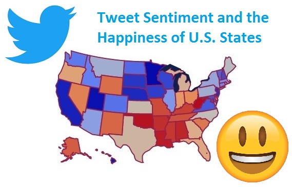

# [트위터 감성분석 (Twitter Sentiment Analysis)](https://sooeun67.github.io/twitter_sentiment_happiness/)

### 이 프로젝트는 미국 내 트위터 감성 분석을 통해 사람들의 행복도 상관성 및 관계를 살펴본다. 

파이썬으로 트위터 데이터를 스크랩하고, Wallethub 사이트로부터 데이터를 수집했으며 데이터 전처리를 진행했다. 트위터 데이터와 주별 행복도 데이터의 주요 특징들을 살펴보며 데이터 인사이트를 도출하였다.

**The study of Twitter Sentiment Analysis investigates whether there is a relationship with the sentiment of Twitter content and the overall happiness of a state within the United States.** As part of this analysis, relevant data from Twitter and WalletHub were collected from their respective sites using Python, assessed for cleanliness, and cleansed as necessary. Once cleaned, key attributes of the Twitter and State Happiness Data were investigated for initial insight and then deeper analyses were conducted to interpret the data and perform predictive analysis.

