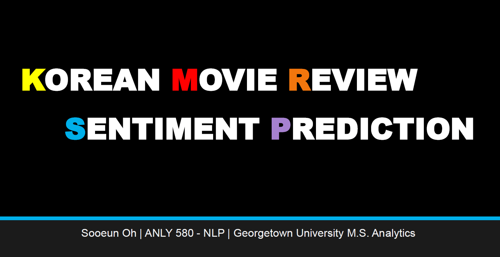

# [네이버 영화리뷰 데이터를 활용한 감성 분석 (Korean Movie Review Sentiment Analysis)](https://github.com/sooeun67/NLP/blob/master/korean_movie_project/aboutme.md)

- ### The full report is located [here](https://github.com/sooeun67/NLP/blob/master/korean_movie_project/korean_movie_paper.pdf)
- ### The poster for 10 minute presentation is located [here](https://github.com/sooeun67/NLP/blob/master/korean_movie_project/korean_movie_poster.pdf).
- ### The full code is located [here](https://github.com/sooeun67/NLP/blob/master/korean_movie_project/korean_movie.ipynb).

In this study, we explore various machine learning (ML) tools and natural language processing (NLP) methods to perform a prediction analysis of movie ratings. Prior to the prediction process, this paper presents data collection and step of data pre-processing with the introduction of Python libraries and packages available.

*Note: Data used in the projects is obtained from Naver Movie Reviews.*